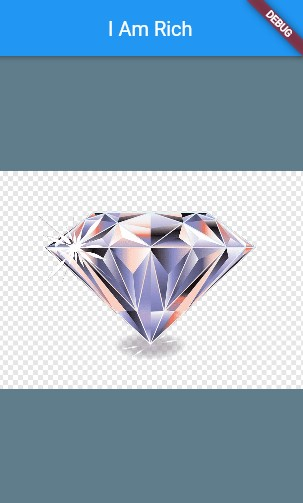

<h1 align=center>Flutter ❤</h1>

## flutter-01-IAmRich
  > Create a flutter project and paste the files and folders in this repository in their respective places

## All Flutter Projects

| SN | Project Name | Link |
| :---: | :--- | :---: |
|0|Hello World|[Let's Go](https://github.com/Rahullkumr/flutter-00-helloWorld)|
|1|I am Rich|[Let's Go](https://github.com/Rahullkumr/flutter-01-IAmRich)|
|2|My Card|[Let's Go](https://github.com/Rahullkumr/flutter-02-MyCard)|
|3|Dicee|[Let's Go](https://github.com/Rahullkumr/flutter-03-Dicee)|

## The App

- An app which has an appbar saying I Am Rich
- an image from the assets/images folder
- having details of how to change the app-icon in android and ios devices.

## use Image inside the Scaffold:

1. NetworkImage ('imageLink'): from the internet 

2. AssetImage ('images/imageName'): 
  - first you need to uncomment the assets folder in pubspec.yaml 
  - then, `flutter pub get` will automatically run(if not, run it manually)
  - add `AssetImage('images/imageName.extension')` to your code

## Custom app icons
1. for Android devices
  - goto `https://www.appicon.co/` and download your icon
  - go inside android/app/src/main/res/
  - replace all `mipmap` folders with downloaded ones
2. For ios devices
  - goto `https://www.appicon.co/` and download your icon
  - go inside ios/Runner/
  - replace `Assets.xcassets` folder with downloaded one

